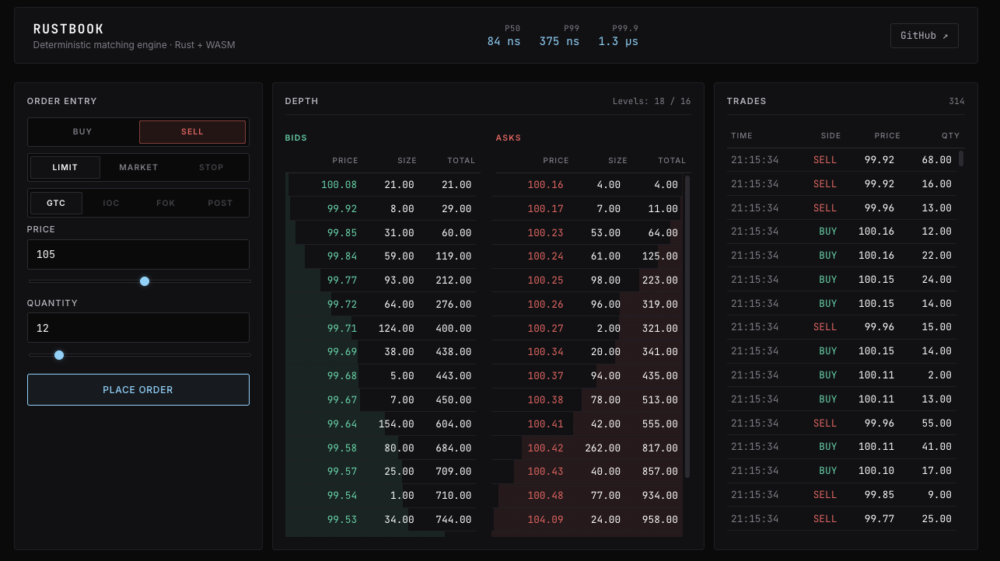

# RustEngine

A deterministic matching engine in Rust, running in the browser via WebAssembly. Built to demonstrate market-microstructure understanding, low-latency systems thinking, and Rust ownership/borrowing mastery — not as a production exchange, but as a credible research-quality artifact.

[](https://rust-engine.dev) &nbsp; [](ARCHITECTURE.md)



## Highlights

- **Native p50 ~84 ns / p99.9 ~1.25 µs** matching latency on Apple Silicon (criterion + HDR histogram, burst of 100k mixed limit/market orders)
- **Deterministic replay** — store seed + config (~100 bytes), regenerate any session bit-for-bit; UI scrubber to step through events at variable speed
- **Full order lifecycle** — limit, market (IOC semantics), cancel (O(log L + K) via order-ID index), amend (size-down preserves FIFO priority)
- **Pre-trade risk gate** — fat-finger / notional / mid-deviation checks before any order touches the book
- **Realistic synthetic flow** — seeded ChaCha8 simulator with Poisson arrivals drives bursts up to 10k orders; deterministic across runs and platforms
- **Honest performance framing** — the UI's live "demo throughput" is explicitly distinguished (via tooltip) from the citable native benchmarks in the Metrics tab

## Stack

Rust core (`engine_core`) · WebAssembly bridge (`engine_wasm` via `wasm-bindgen`) · React + Vite UI · `criterion` + `hdrhistogram` for benchmarks.

## Run it locally

```bash
# Tests
cargo test -p engine_core

# WASM bundle
cd engine_wasm && wasm-pack build --target bundler

# UI dev server (http://localhost:5173)
cd ../ui/orderbook-ui && npm install && npm run dev

# Native benchmarks (regenerates ui/orderbook-ui/public/bench-results.json)
cd ../.. && cargo run --release --bin bench_export
```

## What's next

- ITCH/OUCH parser — replay a real NASDAQ trading day through the engine
- Avellaneda-Stoikov market-making bot wired into the simulator
- Arena-allocated intrusive linked list for true O(1) cancel
- Separate risk gateway process (currently risk is integrated into the engine)

---

See [ARCHITECTURE.md](ARCHITECTURE.md) for the engineering deep-dive: data structures, matching algorithm, simulator design, replay determinism contract, benchmarking methodology, and design alternatives considered.
